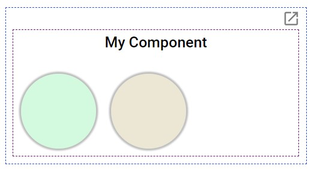

# Angular Opinionated Popout Window

[](https://opensource.org/licenses/MIT)
[](https://www.npmjs.com/package/angular-popout-window)

Check out what this library can do at the [demo website](https://glimmer.github.io/angular-opinionated-popout-window/)

## Why Use this Library?
AOPW is a batteries-included approach to adding popoutable components to your application. This library is based on Shemesh's [Angular-Popout-Window](https://shemesh.github.io/angular-popout-window/), which has taken lengths to make sure your component looks the same in the child window as it did in the parent.

In general, this library focuses on ease-of-use while APW allows for greater customization, full changelog below.
<br>
<br>


## Requirements
This library is compiled using Angular Ivy - therefore your application must use at least Angular version 12. 
<br>
<br>

## Installation
Install via NPM

```
npm install angular-opinionated-popout-window
```

And add it to your App Module
```
import { PopoutWindowModule } from 'angular-popout-window';

@NgModule({
  imports: [
    ...
    PopoutWindowModule,
  ],
})
export class AppModule {}
```

And that's all the setup you need!
<br>
<br>

## Usage

This library is all about simplicity, all you'll typically need is this:

```
...
<popout-window>
  <your-component></your-component>
</popout-window>
...
```

The above code will wrap your component, adding a dock/undock button which sits above and to the right of your component. The resulting box-model will look like the image below, with the purple line representing your component, and the blue line representing the added wrapping margin *(colored outlines added for example purposes only)*.



<br>

## API

| Input/Output                    | Datatype    | Default Value         | Description
| ------------------------------- | ----------- | --------------------- | -----------------------------
| \[windowTitle\]                 | string      | window.document.title | Sets the document title of the child window
| \[whiteIcon\]                   | boolean     | false                 | Inverts color of undock icon, e.g. for dark themes
| \[wrapperRetainSizeOnPopout\]   | boolean     | false                 | Whether container for popoutable component retains its dimensions on popout - allows you to optimize for UI stability, or UI density
| \(closed\)                      | void        | n/a                   | Emits on close, either via pop-in button or simply close of the child window  

<br>
<br>
And if you need to programmatically open or close the popout window, simply make a reference to the popout-window component in your html:

```
...
<popout-window #popoutWindow>
  <your-component></your-component>
</popout-window>
...
```

From your component.ts:
```
@ViewChild('popoutWindow') private popoutWindow: PopoutWindowComponent;
```

Now you can call...
```
this.popoutWindow.popOut();
this.popoutWindow.popIn();
```
<br>
<br>

## Changelog from Angular-Popout-Window
1. Adding builtin toggle button, with optional color inversion
2. Adding preserve-wrapper-size option
3. Window now attempts to open with titlebar under users cursor for quick drag re-positioning, rather than attempting to overlay original position
4. Removed many customizations around sizing and placement
<br>
<br>

## License

MIT
